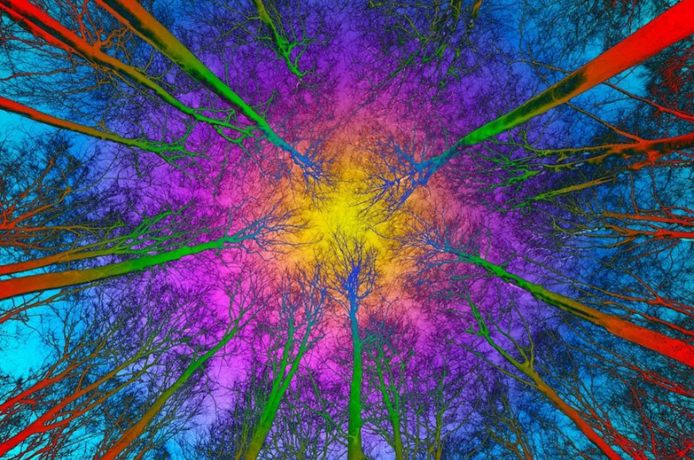

<p align="center">
  
</p>

# Vortex Math · Unit Circle Visualization

Map **positions on the unit circle** obtained by stepping arc lengths of exactly **`9/π` radians** onto **vortex math** concepts: digital roots, the doubling circuit **1-2-4-8-7-5**, and the special role of **3-6-9**.

## Why 9/π?

The unit circle has circumference `2π`. Advancing by a fixed arc `Δθ = 9/π` each step yields the orbit

```text
θ_k = k · (9/π)  (mod 2π)
(x_k, y_k) = (cos θ_k, sin θ_k)
```

The factor **9** echoes the digital-root base of vortex math (digits collapse mod 9 into 1–9). **π** is the circle’s own constant. Relative to a full turn `2π`, this step produces an **irrational rotation** in the usual dense-orbit sense: long sequences fill the circumference densely rather than closing on a short regular polygon (contrast with equal spacing `2π/9`).

Each point is then colored by a **vortex digit** (1–9)—by default the digital root of the step index—so the geometry of the circle and the numerology of the doubling / Trinity patterns can be seen together.

### Vortex concepts used here

| Concept | Meaning in this project |
|--------|-------------------------|
| **Digital root** | Iterated digit sum → single digit 1–9 (`n mod 9`, with multiples of 9 → 9) |
| **Doubling circuit** | `1 → 2 → 4 → 8 → 7 → 5 → 1` (digital roots of powers of 2) |
| **3-6-9 (Trinity)** | Digits outside pure doubling; often drawn as a control / axis (9 highlighted at center) |

## Project layout

```text
vortex_math/
├── README.md
├── requirements.txt
├── .gitignore
├── src/
│   ├── __init__.py
│   ├── core.py          # Pure math (digital root, sequences, circle positions)
│   ├── visualize.py     # Matplotlib + Plotly plots & animations
│   └── main.py          # CLI entry point
├── notebooks/
│   └── exploration.ipynb
├── assets/              # Generated PNGs, GIFs, HTML
└── tests/
    └── test_core.py
```

## Install

```bash
cd ~/Projects/vortex_math
python -m venv .venv
source .venv/bin/activate   # Windows: .venv\Scripts\activate
pip install -r requirements.txt
```

Optional for tests:

```bash
pip install pytest
```

## Run

From the project root:

```bash
# Default demo — writes key figures under assets/
python src/main.py --demo

# Stepped unit circle (colored by vortex digit)
python src/main.py --plot-steps --num-steps 100

# Side-by-side vortex star + orbit
python src/main.py --vortex-flow --num-steps 80

# Density / fill of a long orbit
python src/main.py --density --num-steps 2000

# 3D toroidal projection (black high-contrast wireframe)
python src/main.py --torus --num-steps 300

# Torus construction (default): watch the 9/π winding build point-by-point
# Default resolution is 1080p MP4
python src/main.py --animate-torus --steps 300

# GIF preview of the same construction
python src/main.py --animate-torus --steps 200 --save-gif

# Optional: spin the finished orbit instead of constructing it
python src/main.py --animate-torus --mode spin --steps 300

# Higher res (NVENC on RTX 4090)
python src/main.py --animate-torus --4k --steps 400 --fps 30
# encoder: --encoder auto|h264_nvenc|hevc_nvenc|av1_nvenc|libx264

# Animation → assets/circle_steps.gif
python src/main.py --animate --steps 300 --save-gif

# Interactive Plotly HTML
python src/main.py --interactive

# Custom step / mapping
python src/main.py --plot-steps --step 9/pi --method angle_bin --num-steps 150
```

### Python API

```python
from src.core import (
    digital_root,
    vortex_doubling_sequence,
    circle_positions,
    position_to_vortex_digit,
    DEFAULT_STEP_RADIANS,
)
from src.visualize import plot_unit_circle_with_steps, animate_circle_steps

print(digital_root(247))                 # 4
print(vortex_doubling_sequence(6))       # [1, 2, 4, 8, 7, 5]
x, y = circle_positions(50)              # step default = 9/π

fig = plot_unit_circle_with_steps(num_steps=100, save_path="assets/out.png")
```

## Current visualizations

| Output | Description |
|--------|-------------|
| `assets/unit_circle_steps.png` | Scatter on the unit circle, colored by vortex digit; labels; 1–9 overlay + doubling star |
| `assets/vortex_flow.png` | Classic vortex star beside the 9/π orbit |
| `assets/density_heatmap.png` | Plane density + angular histogram (dense fill) |
| `assets/torus_projection.png` | Parametric 3D torus winding (black wireframe, vortex-colored points) |
| `assets/torus_1080p.mp4` | **Default:** point-by-point torus construction at 1080p (`--animate-torus`) |
| `assets/torus_construct.gif` | Same construction as GIF (`--animate-torus --save-gif`) |
| `assets/torus_4k.mp4` | 4K construction (or spin with `--mode spin --4k`) |
| `assets/interactive_circle.html` | Plotly figure with frames / slider over `num_steps` |
| `assets/circle_steps.gif` | Progressive animation of the orbit (via `--animate --save-gif`) |

### Mapping methods (`--method`)

- `step_index` (default) — digital root of the step index when `m=9` (step 0 → 9); else `k % m`
- `mod` — always plain `k % m` (no digital-root special case)
- `angle_bin` — `m` equal arcs (1–9 when `m=9`, else 0…m−1)
- `sin_dr` / `cos_dr` — digital root or modular map of scaled `|sin θ|` / `|cos θ|`
- `doubling_cycle` — ×2 orbit mod `m` by step index (classic 1-2-4-8-7-5 when `m=9`)

Register custom mappings with `core.register_mapping(name, fn)`.

### Labeling modulus (`--modulus` / `-m`)

Geometric step stays **`9/π`** by default. Only the **label** set changes with `m`:

```bash
# Classic vortex digits
python src/main.py --plot-steps --modulus 9

# Full-period doubling vortex (2 is a primitive root mod 37)
python src/main.py --plot-steps -m 37 --num-steps 150

# Prime-mover composite (3×37)
python src/main.py --plot-steps -m 111

# CRT product 9×37
python src/main.py --plot-steps -m 333

# Sweep structure + side-by-side comparison (9, 37, 111, 333)
python src/main.py --sweep-moduli --num-steps 120
```

### Step mode (`--step-mode`) — couple geometry to m

| mode | Arc step | Meaning |
|------|----------|---------|
| `nine_over_pi` (default) | `9/π` | Labels change with m; **positions fixed** |
| `m_over_pi` | `m/π` | Winding rate **and** labels couple to m |

```bash
# Most interesting: resonance of m/π rotation with label set m
python src/main.py --plot-steps -m 37 --step-mode m_over_pi --num-steps 150
python src/main.py --plot-steps -m 111 --step-mode m_over_pi

# Full sweep: circle + density + torus under m/π
python src/main.py --sweep-moduli --step-mode m_over_pi --sweep-views all --num-steps 120

# Extended moduli (adds 7, 13, 27, 41)
python src/main.py --sweep-moduli --extended --step-mode m_over_pi --sweep-views circle,density
```

### Paired CRT labeling (`--method paired`)

Keeps **both** classic digital roots and residue mod m:

```bash
python src/main.py --plot-steps -m 37 --method paired --num-steps 150
python src/main.py --paired-panel -m 37 --num-steps 150
```

Packed code: `(digital_root − 1) · m + (k mod m)`.

Core helpers: `doubling_orbit`, `modular_label`, `step_radians_for`, `paired_label`, `labels_for_orbit`.

### Quantitative analysis

```bash
# Single modulus: both step modes, fill + near-return + label–angle NMI
python src/main.py --orbit-stats -m 37 --num-steps 500

# 37-family (37, 111, 333): stats + circle/torus dual-mode panels
python src/main.py --family-37 --num-steps 200

# 111 prime-mover motif: rank moduli by label–angle resonance under m/π
python src/main.py --resonance-scan --num-steps 600
```

| Metric | Meaning |
|--------|---------|
| `len×2` / `cyc` | Algebraic ×2 orbit from 1 / number of cycles on ℤ/mℤ |
| `ret_k` / `ret_d` | Best geometric near-return step and fractional-turn distance |
| `unif` / `prog` / `sym` | Angular uniformity, label progression, composite symmetry |
| `NMI` | Raw label–angle normalized mutual information (**cardinality-biased**) |
| `exNMI` | **NMI − shuffle-null mean** — fair label–geometry lock across moduli |
| `z` | How many σ above the permutation null |
| `Δex` | exNMI under `m/π` minus exNMI under fixed `9/π` |

**Prefer `exNMI` over raw `NMI` when comparing different m** (raw NMI rises with more labels even without true lock).

**Positive control (validates the null baseline):**

```bash
# Labels are angle bins by construction → strongly positive exNMI
python src/main.py --resonance-scan --method angle_bin --num-steps 600

# Contrast: step-index labels on irrational rotation → exNMI ≲ 0
python src/main.py --resonance-scan --method step_index --num-steps 600
```

Helpers: `orbit_stats`, `family_orbit_report`, `resonance_scan`, `FAMILY_37`, `FAMILY_111`.

### Practical symmetry metrics (`src/analysis.py`)

Comparable scores in ~[0, 1] for any `(step_mode, m, n)`:

| Score | Measures |
|-------|----------|
| `angular_uniformity` | Even fill across angular sectors (`1/(1+CV)`) |
| `label_progression` | Orderly label winding when sorted by angle |
| `sector_purity` | How pure vs mixed colors are inside sectors |
| `symmetry_score` | `0.6·uniformity + 0.4·progression` |

```bash
# Core moduli table under both step modes
python src/main.py --metrics-sweep --num-steps 500

# 37-family only
python src/main.py --metrics-sweep --family-37 --num-steps 500

# Extended + paired labels
python src/main.py --metrics-sweep --extended --method paired --num-steps 500
```

```python
from src.analysis import metrics_for_experiment, metrics_sweep

print(metrics_for_experiment(37, "m_over_pi", num_steps=500))
rows = metrics_sweep([9, 37, 111, 333], num_steps=500)
```

## Tests

```bash
pytest tests/ -v
```

## High-resolution / GPU video (RTX 4090)

Matplotlib still **draws** frames on the CPU, but **encoding** can use your NVIDIA GPU via ffmpeg NVENC — very fast on an RTX 4090 for 4K/8K MP4.

Requirements: system `ffmpeg` built with NVENC (you already have `h264_nvenc` / `hevc_nvenc` / `av1_nvenc` if `ffmpeg -encoders | grep nvenc` lists them).

```python
from src.visualize import animate_torus_projection, nvenc_available

print("NVENC:", nvenc_available())  # True on this machine

animate_torus_projection(
    num_steps=300,
    mode="construct",      # default: build the winding step-by-step
    resolution="1080p",    # default
    fps=30,
    encoder="auto",        # prefers h264_nvenc → hevc_nvenc → libx264
    cq=18,
    save_path="assets/torus_1080p.mp4",
)
```

| Approach | GPU use | Quality | Notes |
|----------|---------|---------|--------|
| Matplotlib + NVENC | Encoding | Very good | Default path in this repo |
| PyVista / VTK | Full render | Excellent | Optional next step |
| Manim / Blender | Full | Cinematic | Future |

**8K note:** `h264_nvenc` is limited to ~4096×4096 on GeForce cards, so **8K (7680×4320) cannot use H.264 NVENC**. The pipeline auto-upgrades to `hevc_nvenc` (or `av1_nvenc` / `libx265`) when the frame size exceeds that limit. Prefer:

```bash
python src/main.py --animate-torus --8k --encoder hevc_nvenc --cq 16
# or simply --8k --encoder auto  (picks hevc_nvenc for 8K)
```

## Design notes

- **Math vs. rendering**: all pure functions live in `src/core.py`; plotting only in `src/visualize.py`.
- **Configurable**: step size, mapping method, and style (`dark` / `light`) are parameters (see also `default_config()`).
- **Irrational rotation**: large `num_steps` intentionally produces dense covering; density plots make that visible.
- **Extensible**: add mappings, new projections, or sound without rewriting the orbit math.

## Ideas for next iterations

Once the base visualizations are working, iterate with prompts like:

- “Add a 3D toroidal projection of the stepped points.” *(starter already in `plot_torus_projection`)*
- “Color points by digital root of sin(θ) or other trig functions.” *(see `sin_dr` / `cos_dr`)*
- “Create an interactive dashboard with sliders using Dash or Streamlit.”
- “Map the sequence to musical notes or frequencies and generate audio.”
- “Compare multiple step sizes (including `2π/9` for equal spacing vs `9/π`).”
- “Rodin-coil inspired multi-winding on a torus with 3-6-9 highlighted as a poloidal axis.”
- “Export SVG layers for print / laser (number circle + orbit separately).”

## Research note & book section

| Doc | Role |
|-----|------|
| **[docs/book_section_modulus_invariants.md](docs/book_section_modulus_invariants.md)** | Book-ready prose + figure |
| **[docs/RESEARCH_NOTE_moduli.md](docs/RESEARCH_NOTE_moduli.md)** | Full experimental backing |
| **`assets/book_figure_three_layers.png`** | Composite figure (algebra · flow · control) |

Use those when referencing this work from the main 111 / book project.

## License / context

Educational visualization project. Vortex math here is treated as a **numerological / geometric motif** (digital roots and doubling patterns), not as a claim about physics. Explore, plot, and extend freely.
